# Estrutura do projeto
```plaintext
AgendaTEC/

├── .env                 # Variáveis de ambiente (Esse arquivo nunca é enviado para o repositório!)
├── .env.example         # Exemplo das variáveis de ambiente
├── .gitignore           # Arquivos ignorados pelo git
├── Caddyfile            # Arquivo de configuração do DNS da aplicação
├── Dockerfile           # Criação da imagem do container da aplicação
├── docker compose.yml   # Orquestração dos containers
├── manage.py            # Utilizado para interagir com o projeto via linha de comando
├── requirements.txt     # Dependências do projeto
│
├── core/                # Diretório com as configurações globais do projeto
│   ├── __init__.py      # Torna o diretório um pacote Python
│   ├── settings.py      # Configurações gerais do projeto (DB, apps, middlewares etc.)
│   ├── urls.py          # Arquivo principal de rotas/URLs do projeto
│   ├── asgi.py          # Configuração para servidores ASGI (WebSockets, etc.)
│   └── wsgi.py          # Configuração para servidores WSGI (produção tradicional)
│
└── app/
    ├── __init__.py             
    ├── admin.py         # Registro dos modelos para o admin do Django
    ├── apps.py          # Configuração do app para o Django
    ├── models.py        # Definição das classes que representam as tabelas do banco de dados
    ├── views.py         # Funções ou classes que retornam respostas (lógica de exibição)
    ├── urls.py          # (opcional) Rotas específicas do app
    ├── forms.py         # (opcional) Formulários baseados em Django Forms ou ModelForms
    ├── tests.py         # (opcional) Testes automatizados (usando unittest ou pytest)
    └── migrations/      # Histórico de migrações do banco de dados
        └── __init__.py
```
# Topologia de rede


# Iniciando

## Pré-requisitos

#### Obrigatórios:
- [Python 3.10+](https://www.python.org/)
- [Docker](https://www.docker.com/)
- [Docker Compose](https://docs.docker.com/compose/)

#### Opcionais:
- [PyCharm](https://www.jetbrains.com/pycharm/)

**Observações:** 
- O PyCharm, assim como outras IDEs da [JetBrains](https://www.jetbrains.com/) 
pode ser utilizado na versão Professional de forma gratuita com o email institucional. 


# Configuração de chave SSH e clone do repositório

Para clonar um repositório do GitHub via SSH, cada pessoa precisa ter um par de chaves (uma privada e uma pública) e cadastrar a chave pública na própria conta do GitHub. Isso evita digitar usuário e senha toda vez que for usar o Git.

Siga os passos na ordem, usando o Git Bash (recomendado no Windows) ou o terminal do seu sistema operacional.

## Pré-requisitos

- Git instalado na máquina (o Git Bash já vem junto no Windows)
- Conta pessoal no [GitHub](https://github.com)
- Acesso liberado como colaborador no repositório `labnext-faculdade-dom-bosco/AgendaTEC`

## Passo 1: Verificar se já existe uma chave SSH

```bash
ls -al ~/.ssh
```

Esse comando lista os arquivos da pasta `.ssh`. Se já existirem os arquivos `id_ed25519` e `id_ed25519.pub`, pule direto para o Passo 5. Se a pasta não existir ou esses arquivos não aparecerem, siga para o próximo passo.

Se o comando acima retornar um erro como `No such file or directory`, a pasta `.ssh` ainda não existe na sua máquina. Nesse caso, crie ela com:

```bash
mkdir ~/.ssh
```

## Passo 2: Gerar uma nova chave SSH

```bash
ssh-keygen -t ed25519 -C "seuemail@exemplo.com"
```

Troque `seuemail@exemplo.com` pelo e-mail cadastrado no seu GitHub. O `-t ed25519` define o tipo de chave (mais moderno e seguro que o antigo RSA) e o `-C` adiciona um comentário só para identificar a chave depois.

O terminal vai fazer duas perguntas:

- `Enter file in which to save the key`: aperte Enter para aceitar o local padrão.
- `Enter passphrase`: uma senha extra, opcional, para proteger a chave. Pode digitar uma senha ou deixar em branco (Enter duas vezes). Atenção: se escolher usar senha, digite exatamente igual nas duas vezes, senão aparece `Passphrases do not match` e o processo pede de novo.

Ao final, aparece uma mensagem parecida com esta, confirmando que a chave foi criada, incluindo o desenho (randomart) gerado a partir da chave:

```
Your identification has been saved in /c/Users/seu-usuario/.ssh/id_ed25519
Your public key has been saved in /c/Users/seu-usuario/.ssh/id_ed25519.pub
The key fingerprint is:
SHA256:xxxxxxxxxxxxxxxxxxxxxxxxxxxxxxxxxxxxxxxxxxx seuemail@exemplo.com
The key's randomart image is:
+--[ED25519 256]--+
|      .oo.       |
|     o  ..o      |
|    . .  o .     |
|   .  oo+.o      |
|    ..o+S..      |
|   .  +.=.+      |
|    o..*.*.+     |
|   . +.=.O.o     |
|    .+=+E+o      |
+----[SHA256]-----+
```

O fingerprint e o desenho mudam a cada chave gerada, então o seu vai ser diferente do exemplo acima. O importante é essas linhas aparecerem, confirmando que a chave foi salva com sucesso.

## Passo 3: Configurar o ssh-agent como serviço do Windows

Isso só precisa ser feito uma vez em cada computador. Abra o PowerShell como Administrador (clique com o botão direito no ícone do PowerShell e escolha "Executar como administrador") e rode:

```powershell
Get-Service ssh-agent | Set-Service -StartupType Automatic
Start-Service ssh-agent
```

Isso configura o ssh-agent para iniciar sozinho junto com o Windows, em vez de precisar ser iniciado manualmente a cada terminal novo.

## Passo 4: Adicionar a chave ao ssh-agent

De volta ao Git Bash, adicione a chave criada no Passo 2:

```bash
ssh-add ~/.ssh/id_ed25519
```

Como o ssh-agent agora roda como serviço do Windows, a chave fica guardada e carregada automaticamente mesmo depois de reiniciar o computador. Não deve ser necessário repetir esse comando depois disso.

## Passo 5: Copiar a chave pública

```bash
cat ~/.ssh/id_ed25519.pub
```

Isso mostra o conteúdo da chave pública no terminal. Copie tudo, do início (`ssh-ed25519`) até o final (o e-mail usado no `-C`).

Importante: nunca compartilhe o arquivo `id_ed25519` (sem o `.pub`). Ele é a chave privada e deve ficar só na sua máquina.

## Passo 6: Cadastrar a chave pública no GitHub

1. Entre no GitHub e clique na sua foto de perfil, no canto superior direito.
2. Vá em **Settings**.
3. No menu lateral esquerdo, clique em **SSH and GPG keys**.
4. Clique em **New SSH key**.
5. Em **Title**, coloque um nome que identifique o computador (por exemplo, "Notebook pessoal").
6. Em **Key**, cole a chave pública copiada no Passo 5.
7. Clique em **Add SSH key**. O GitHub pode pedir a senha da conta ou o código de autenticação de dois fatores para confirmar.

## Passo 7: Testar a conexão

```bash
ssh -T git@github.com
```

Na primeira conexão, pode aparecer uma pergunta perguntando se quer continuar: digite `yes` e aperte Enter. Se estiver tudo certo, a resposta será parecida com:

```
Hi seu-usuario! You've successfully authenticated, but GitHub does not provide shell access.
```

Essa mensagem confirma que a chave SSH está funcionando.

## Passo 8: Clonar o repositório

No mesmo terminal que você já vem usando (não precisa abrir o explorador de arquivos), use o `cd` para entrar na pasta onde quer guardar o projeto. O caminho `~/Documents` abaixo é só um exemplo, troque pelo caminho que você preferir:

```bash
cd ~/Documents
```

Depois, clone o repositório:

```bash
git clone git@github.com:labnext-faculdade-dom-bosco/AgendaTEC.git
```

Isso cria uma pasta chamada `AgendaTEC` com todo o código do projeto.

## Passo 9: Conferir se deu certo

```bash
cd AgendaTEC
git status
```

Se aparecer algo como `On branch develop, nothing to commit, working tree clean`, o clone funcionou.

# Executando o projeto
Com o projeto clonado abra na sua IDE e siga os passos abaixo:

### Configurar variáveis de ambiente
Em ambiente Windows:
```
copy .env.example .env
```

Em ambiente Linux:
```
cp .env.example .env
```
Em seguida, altere os valores conforme necessário.


### Criar containers e subir a aplicação
Realiza o build da aplicação, utilizado na primeira execução ou quando a estrutura do projeto é alterada.
Ex.: Adição de novas bibliotecas, imagens, etc.
```
docker compose up --build -d
```

Sobe a aplicação sem realizar o build.
```
docker compose up
```

Derruba os containers e para a aplicação
```
docker compose down
```

### Banco de dados
Para interagir com o banco de dados utilizamos o conceito de `migrações`.

O comando de criar migrações percorre todo o projeto e verifica se algum modelo foi criado ou alterado, 
O comando seguinte aplica de fato essas alterações no banco de dados, criando e/ou alterando tabelas.

1. Criar migrações
```
docker compose exec web python3 manage.py makemigrations
```

2. Aplicar migrações
```
docker compose exec web python3 manage.py migrate
```

3. Criar superusuário (opcional)
```
docker compose exec web python3 manage.py createsuperuser
```

**Observações:** 
- Na primeira vez executando o projeto, é necessário realizar os três passos acima.


### Criando novo app
No Django, um app é uma unidade modular de código que implementa uma funcionalidade específica do projeto.
```
docker compose exec web python3 manage.py startapp my_app_name
```
**Observações:** 
- Ao criar um novo `app` é necessário adicioná-lo em `INSTALLED_APPS` do arquivo `setting.py` 
para que o Django instale ele. 
- Em seguida, é necessário utilizar os comandos `makemigrations` e `migrate`, 
para criar as tabelas do novo `app` no banco de dados.


### Realizando testes
#### 1. Executando teste específico:

```
docker compose exec web python3 manage.py test message.tests.WahaServiceTestCase.test_send_message
```

#### 2. Executando todos os testes da classe
```
docker compose exec web python3 manage.py test message.tests.WahaServiceTestCase
```

#### 3. Executando todos os testes do app
```
docker compose exec web python3 manage.py test message
```
Obs: 
- Substituir de acordo com o nome do app/classe/método. Nesse exemplo, os testes serão realizados no app **message**
que é utilizado para enviar mensagens pelo WhatsApp.


# Configurando DNS e HTTPS
Para configurar um DNS para a aplicação e garantir que seu protocolo seja HTTPS, 
é necessário ajustar os seguintes arquivos:
- Caddyfile
- docker-compose.yml
- .env

## Caddyfile 

### Desenvolvimento local (localhost com HTTPS)

Usa certificado interno gerado pelo próprio Caddy.

```
localhost {
    tls internal
    reverse_proxy web:8000
}
```

### Produção (domínio real)

O Caddy emite e renova o certificado Let's Encrypt automaticamente.

```
meusite.com.br {
    reverse_proxy web:8000 {
        header_up X-Forwarded-Proto {scheme}
    }
}
```

`web` é o nome do serviço Django no `docker-compose.yml`.

### Configurando logs de acesso
Para configurar logs no Caddy, basta adicionar essa seção:
```
log {
    output file /data/logs/access.log {
        roll_size 10mb
        roll_keep 10
        roll_keep_for 720h
        mode 0644
    }
    format json
    level INFO
}
```
- roll_size: Tamanho de cada arquivo de log;
- rool_keep: Quantidade de arquivos de log;
- roll_keep_for: Quantidade de horas que ele mantém os registros de log (default: 30 dias);
- mode 0644: Permissão de leitura no arquivo

---

## docker-compose.yml

No `docker-compose.yml` é necessário adicionar o serviço `caddy` e garantir que todos os serviços 
que precisam se comunicar estejam na mesma rede docker.

```yaml
services:
  web:
    expose:
      - "8000"  # Não expõe a porta para o host pois o Caddy acessa internamente
    networks:
      - web

  caddy:
    image: caddy:2-alpine
    restart: unless-stopped
    ports:
      - "80:80"    # http
      - "443:443"  # https
    volumes:
      - ./Caddyfile:/etc/caddy/Caddyfile
      - caddy_data:/data  # Armazena os certificados TLS
      - caddy_config:/config
    networks:
      - web

networks:
  web:

volumes:
  caddy_data:
  caddy_config:
```

**Importante:** todos os serviços que precisam se comunicar entre si devem estar na mesma rede (`web`). 
Sem isso, o Caddy não alcança o Django e o Django não alcança o banco.

## Variáveis de ambiente (.env)

Desenvolvimento local:

```env
DJANGO_ALLOWED_HOSTS=localhost,127.0.0.1
CSRF_TRUSTED_ORIGINS=https://localhost
```

Produção:

```env
DJANGO_ALLOWED_HOSTS=meusite.com.br
CSRF_TRUSTED_ORIGINS=https://meusite.com.br
```

Múltiplos valores separados por vírgula são suportados.
---

## Subindo a aplicação

```bash
docker compose up -d
```

Na primeira execução o Caddy já obtém o certificado automaticamente. Os volumes `caddy_data` e `caddy_config` devem sempre ser persistidos  sem eles os certificados são perdidos a cada restart.

---

## Desenvolvimento local  confiar no certificado

Em ambiente local com `tls internal`, o browser exibe aviso de certificado não confiável. Para resolver:

```bash
# Instala o certificado raiz do Caddy no sistema
docker compose exec caddy caddy trust
```

Reinicia o browser completamente após rodar o comando.

**Firefox** tem repositório próprio de certificados e ignora o do sistema. Exporta o certificado e importa manualmente:

```bash
docker compose cp caddy:/data/caddy/pki/authorities/local/root.crt ./caddy-root.crt
```

Depois em `about:preferences#privacy` → **Ver Certificados** → **Importar** → seleciona `caddy-root.crt` → marca "Confiar para identificar sites".

---

## Produção  pré-requisitos

Antes de subir em produção:

1. **DNS configurado**  o registro tipo `A` do domínio deve apontar para o IP do servidor
2. **Portas abertas**  80 e 443 liberadas no firewall/security group do servidor
3. **`DEBUG=False`** no `settings.py`
4. **Gunicorn** no lugar do `runserver` no docker-compose.yml:

```yaml
command: gunicorn core.wsgi:application --bind 0.0.0.0:8000 --workers 3
```

## Migração local → produção

É necessário alterar apenas os arquivos: `.env` e `Caddyfile`.

| Arquivo | Local | Produção |
|---|---|---|
| `Caddyfile` | `localhost { tls internal ... }` | `meusite.com.br { ... }` |
| `DJANGO_ALLOWED_HOSTS` | `localhost` | `meusite.com.br` |
| `CSRF_TRUSTED_ORIGINS` | `https://localhost` | `https://meusite.com.br` |

O Caddy cuida do certificado Let's Encrypt automaticamente  sem nenhuma configuração extra.

---

## Diagnóstico

**Verificar se o Django está acessível pelo Caddy:**
```bash
docker compose exec caddy wget -qO- http://web:8000
```

**Verificar logs do Caddy:**
```bash
docker compose logs caddy
```

**Testar HTTPS via curl:**
```bash
curl -v https://meusite.com.br
```

**Verificar se as portas estão abertas:**
```bash
curl -v http://IP_DO_SERVIDOR
curl -v https://IP_DO_SERVIDOR -k
```

Se travar no `Trying`, as portas estão bloqueadas no firewall.
